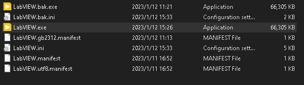

# Windows和Linux下LabVIEW的VI互操作

LabVIEW 的一些问题

From <https://lv.qizhen.xyz/appendix_problem> 

看到阮奇帧写的一个关于labVIEW Unicode支持的话题，这其实也是一个LabVIEW的顽疾了，实际上LabVIEW中文环境下的bug很可能就和这个有关。
Linux和macOS下，LabVIEW不仅早早完成了UTF-8支持和64位化甚至已经开始适配原生M1的ARM支持，但是Windows下仍然还是ASCII编码，导致LabVIEW RT不支持中文，Linux RT还是Pharlap下都会乱码导致VI断线。

现在Windows10和Windows11为了改善和WLS的互操作性，在控制面板的区域语言选项已经有了测试版的UTF-8支持，在Control Panel\Clock and Region\Region\Administrative\Language for non-Unicode programs\Change System Locale\Beta:Use Unicode UTF-8 for worldwide language support.可以尝试看看能不能生效，缺点是这个副作用是全局的，会影响所有非Unicode程序。如果生效，可以考虑用NTLEA或者其他第三方工具单独设置LabVIEW。

However there's a "Beta: Use Unicode UTF-8 for worldwide language support" checkbox since Windows 10 insider build 17035 for setting the locale code page to UTF-8

From <https://superuser.com/questions/1033088/is-it-possible-to-set-locale-of-a-windows-application-to-utf-8> 

可以利用微软官方的Windows SDK给LabVIEW签名，测试是可以单独给LabVIEW启用UTF-8支持的具体方法参考
https://learn.microsoft.com/en-us/windows/apps/design/globalizing/use-utf8-code-page
用的是LabVIEW 2023Q3 64bit。

Fusion manifest for an unpackaged Win32 app:

From <https://learn.microsoft.com/en-us/windows/apps/design/globalizing/use-utf8-code-page> 

gb2312

From <https://learn.microsoft.com/en-us/windows/win32/intl/code-page-identifiers?source=recommendations> 

首先备份一个LabVIEW.exe以备不时之需，
编写一个以下内容的LabVIEW.manidest文件：
<?xml version="1.0" encoding="UTF-8" standalone="yes"?>
<assembly manifestVersion="1.0" xmlns="urn:schemas-microsoft-com:asm.v1">
  <assemblyIdentity type="win32" name="..." version="6.0.0.0"/>
  <application>
    <windowsSettings>
      <activeCodePage xmlns="http://schemas.microsoft.com/SMI/2019/WindowsSettings">UTF-8</activeCodePage>
    </windowsSettings>
  </application>
</assembly>
然后安装Windows SDK，利用MT.exe对labVIEW.exe进行签名，如果都安装在默认路径，在命令行里面运行以下命令
"C:\Program Files (x86)\Windows Kits\10\bin\10.0.22621.0\x64\mt.exe" -manifest "C:\Program Files\National Instruments\LabVIEW 2022\LabVIEW.manifest" -outputresource:"C:\Program Files\National Instruments\LabVIEW 2022\LabVIEW.exe";#1
用Linux的LabVIEW编写一个Test.VI

用普通的Windows下的LabVIEW打开，中文是乱码

用签过名的LabVIEW打开，中文可以显示

但是字体列表里面的中文乱码了

可以把签名和没有签名的LabVIEW.exe都保留，测试都可以打开使用

